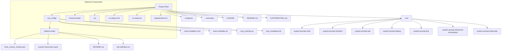
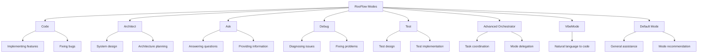
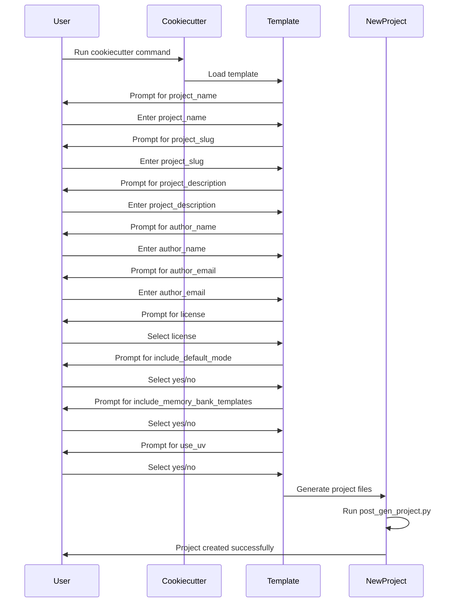
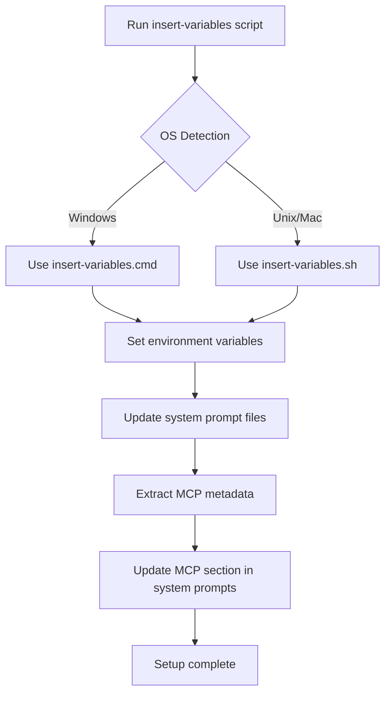

# RooFlow Cookiecutter Documentation

## Table of Contents

- [Introduction](#introduction)
- [Project Overview](#project-overview)
- [Architecture and Components](#architecture-and-components)
  - [Directory Structure](#directory-structure)
  - [System Prompts](#system-prompts)
  - [Configuration Files](#configuration-files)
  - [Modes](#modes)
  - [MCP Integration](#mcp-integration)
- [Getting Started](#getting-started)
  - [Prerequisites](#prerequisites)
  - [Installation](#installation)
  - [Project Generation](#project-generation)
- [Configuration Options](#configuration-options)
- [Post-Generation Setup](#post-generation-setup)
  - [Environment Variables](#environment-variables)
  - [UVX Setup](#uvx-setup)
- [Customization](#customization)
  - [System Prompts](#customizing-system-prompts)
  - [Default Mode](#customizing-default-mode)
  - [Memory Bank](#using-memory-bank)
- [Advanced Features](#advanced-features)
  - [MCP Servers](#mcp-servers)
  - [Custom Modes](#custom-modes)
- [Troubleshooting](#troubleshooting)
- [Contributing](#contributing)
- [FAQ](#faq)
- [References](#references)

## Introduction

RooFlow Cookiecutter is a template for creating new projects with RooFlow integration. RooFlow enhances AI-assisted development by maintaining persistent context across sessions, making development more efficient and consistent.

This documentation provides a comprehensive guide to understanding, setting up, and using the RooFlow Cookiecutter template. It is designed to help new engineers quickly onboard and start working with RooFlow projects.

## Project Overview

[RooFlow](https://github.com/GreatScottyMac/RooFlow) is a framework that enhances AI-assisted development by maintaining persistent context across sessions. It allows AI assistants to:

- Remember previous conversations and decisions
- Access project-specific knowledge and configurations
- Adapt to different development modes (coding, architecture planning, debugging, etc.)
- Provide more consistent and relevant assistance

The RooFlow Cookiecutter template provides everything needed to quickly set up a new project with RooFlow integration, including:

- Configurable project structure with RooFlow integration
- System prompts for different AI assistant modes
- Environment variable setup scripts
- Optional default mode configuration
- Optional memory bank templates
- UVX integration support

## Architecture and Components

### Directory Structure

The RooFlow Cookiecutter template generates a project with the following structure:



### System Prompts

System prompts are stored in the `.roo/` directory and define the behavior and capabilities of different AI assistant modes. The template includes system prompts for:

- **Code Mode**: For implementing features and fixing bugs
- **Architect Mode**: For designing and planning software architecture
- **Ask Mode**: For answering questions and providing information
- **Debug Mode**: For diagnosing and fixing issues
- **Test Mode**: For designing and implementing tests
- **Advanced Orchestrator Mode**: For coordinating complex tasks across modes
- **VibeMode**: For transforming natural language descriptions into code

### Configuration Files

The `roo_config/` directory contains configuration files for the RooFlow project:

- **insert-variables.cmd/sh**: Scripts to set up environment variables
- **mcp_checker.py**: Script to extract MCP metadata
- **mcp_metadata.md**: Contains information about available MCP servers
- **.rooignore**: Specifies files to exclude from the AI context
- **.roomodes**: Defines available modes and their system prompt files

### Modes

RooFlow supports different modes for AI assistants, each specialized for specific tasks:



### MCP Integration

Model Context Protocol (MCP) enables communication with external servers that provide additional tools and resources. The template includes MCP integration with:

- **Playwright**: For browser automation and testing
- **21st Magic**: For UI component generation
- **Tavily**: For web search and content extraction
- **Perplexity**: For additional AI capabilities

## Getting Started

### Prerequisites

- Python 3.6+
- Cookiecutter (`pip install cookiecutter` or `uv pip install cookiecutter`)
- Optional: UVX (`pip install uv`) - A modern Python package installer and resolver

### Installation

You can install the RooFlow Cookiecutter template using either pip or UVX:

#### With pip (traditional)

```bash
# Install cookiecutter if you haven't already
pip install cookiecutter

# Create a new project from this template
cookiecutter gh:hheydaroff/rooflow-cookiecutter
# or from local template
cookiecutter path/to/rooflow-cookiecutter
```

#### With UVX (recommended)

```bash
# Install UVX if you haven't already
pip install uv

# Create a new project from this template
uvx cookiecutter gh:hheydaroff/rooflow-cookiecutter
# or from local template
uvx cookiecutter path/to/rooflow-cookiecutter
```

### Project Generation

When you run the template, you'll be prompted for configuration values:



## Configuration Options

When generating a project, you'll be prompted for these values:

| Option | Description | Default |
|--------|-------------|---------|
| `project_name` | Your project name | "My RooFlow Project" |
| `project_slug` | URL-friendly name | Auto-generated from project_name |
| `project_description` | A short description | "A project using RooFlow for persistent context and optimized AI-assisted development" |
| `author_name` | Your name | "Your Name" |
| `author_email` | Your email address | "your.email@example.com" |
| `license` | Choose a license | MIT, Apache-2.0, GPL-3.0, BSD-3-Clause |
| `include_default_mode` | Include default mode configuration | yes/no |
| `include_memory_bank_templates` | Include memory bank templates | yes/no |
| `use_uv` | Use UVX for Python package management | yes/no |

## Post-Generation Setup

After generating the project, you need to set up the environment:

### Environment Variables

Run the appropriate script to set up environment variables:

- Windows: `roo_config/insert-variables.cmd`
- Unix/Mac: `roo_config/insert-variables.sh`

This will configure the system prompts with your local environment details and MCP section with connected servers.



### UVX Setup

If you chose to use UVX, you can set up your environment by running:

- Windows: `uv-setup.cmd`
- Unix/Mac: `./uv-setup.sh`

This will create a virtual environment and install any dependencies listed in `requirements.txt`.

## Customization

### Customizing System Prompts

System prompts are stored in the `.roo/` directory and can be customized to change the behavior of AI assistants. Each mode has its own system prompt file:

- `.roo/system-prompt-code`
- `.roo/system-prompt-architect`
- `.roo/system-prompt-ask`
- `.roo/system-prompt-debug`
- `.roo/system-prompt-test`
- `.roo/system-prompt-advanced-orchestrator`
- `.roo/system-prompt-vibemode`

### Customizing Default Mode

If you selected to include default mode configuration, your project will include a `roo_config/default-mode` directory with:

- `cline_custom_modes.json`: Configuration for custom AI assistant modes
- `custom-instructions.yaml`: Custom instructions for the AI assistant
- `role-definition.txt`: Role definition for the default mode
- `README.md`: Documentation for the default mode configuration

You can customize these files to change the behavior of the default mode.

### Using Memory Bank

If you selected to include memory bank templates, your project will include a `memory-bank` directory. The memory bank is a feature that allows you to store and retrieve information across AI assistant sessions, helping maintain context and knowledge about your project over time.

To use the memory bank:

1. Add files to the `memory-bank` directory containing important project information
2. These files will be loaded into the AI's context when you start a new session

Recommended memory bank files:

- `projectRoadmap.md`: Track high-level goals, features, and progress
- `currentTask.md`: Detail current objectives, context, and next steps
- `techStack.md`: Document key technology choices and architecture decisions
- `codebaseSummary.md`: Provide a concise overview of project structure and recent changes

## Advanced Features

### MCP Servers

Model Context Protocol (MCP) enables communication with external servers that provide additional tools and resources. The template includes MCP integration with several servers:

#### Playwright MCP

Provides browser automation capabilities:

- Navigate to URLs
- Take screenshots
- Click elements
- Fill forms
- Execute JavaScript
- Perform HTTP requests

#### 21st Magic MCP

Provides UI component generation:

- Generate React components
- Search for logos
- Get component inspiration

#### Tavily MCP

Provides web search and content extraction:

- Search the web
- Extract content from URLs

#### Perplexity MCP

Provides additional AI capabilities.

### Custom Modes

You can create custom modes by:

1. Adding a system prompt file in the `.roo/` directory
2. Adding a reference to the mode in the `.roomodes` file
3. Adding the mode configuration to `roo_config/default-mode/cline_custom_modes.json`

## Troubleshooting

### Common Issues

1. **Environment variables not set correctly**
   - Make sure you've run the appropriate insert-variables script
   - Check that the script has permissions to execute (for Unix/Mac)

2. **UVX not installed**
   - If you selected UVX integration but don't have UVX installed, run `pip install uv`

3. **System prompts not found**
   - Check that the `.roo/` directory exists and contains system prompt files
   - If not, run the insert-variables script to create them

4. **MCP servers not connected**
   - Check that the MCP servers are installed and running
   - Run the insert-variables script to update the MCP metadata

## Contributing

Contributions to the RooFlow Cookiecutter template are welcome! Please see the [CONTRIBUTING.md](CONTRIBUTING.md) file for guidelines on how to contribute.

The contribution process involves:

1. Forking the repository
2. Creating a new branch for your changes
3. Making your changes
4. Testing your changes thoroughly
5. Submitting a pull request with a clear description of the changes

## FAQ

### What is RooFlow?

RooFlow is a framework that enhances AI-assisted development by maintaining persistent context across sessions. It allows AI assistants to remember previous conversations and decisions, access project-specific knowledge, and adapt to different development modes.

### Why use RooFlow Cookiecutter?

RooFlow Cookiecutter provides a standardized way to create new projects with RooFlow integration, saving time and ensuring consistency across projects.

### What is the difference between modes?

Each mode is specialized for a specific task:
- **Code Mode**: For implementing features and fixing bugs
- **Architect Mode**: For designing and planning software architecture
- **Ask Mode**: For answering questions and providing information
- **Debug Mode**: For diagnosing and fixing issues
- **Test Mode**: For designing and implementing tests
- **Advanced Orchestrator Mode**: For coordinating complex tasks across modes
- **VibeMode**: For transforming natural language descriptions into code

### What is Memory Bank?

Memory Bank is a feature that allows you to store and retrieve information across AI assistant sessions, helping maintain context and knowledge about your project over time.

### What is MCP?

Model Context Protocol (MCP) enables communication with external servers that provide additional tools and resources, such as browser automation, UI component generation, web search, and more.

### How do I add a new mode?

To add a new mode:
1. Create a system prompt file in the `.roo/` directory
2. Add a reference to the mode in the `.roomodes` file
3. Add the mode configuration to `roo_config/default-mode/cline_custom_modes.json`

## References

- [RooFlow GitHub Repository](https://github.com/GreatScottyMac/RooFlow)
- [Cookiecutter Documentation](https://cookiecutter.readthedocs.io/)
- [UVX Documentation](https://github.com/astral-sh/uv)
- [Model Context Protocol (MCP) Documentation](https://github.com/anthropics/anthropic-cookbook/tree/main/mcp)